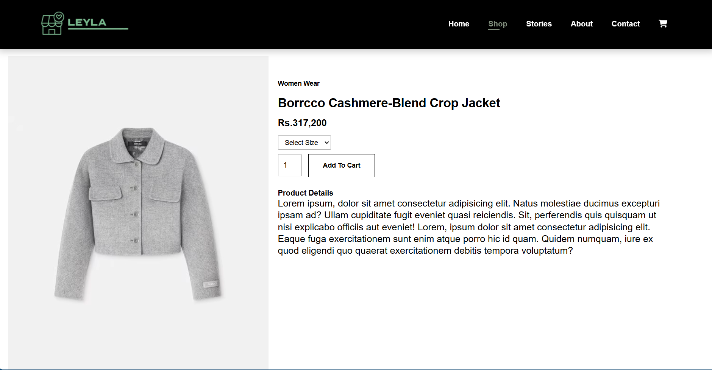

# 🛒 E-Commerce Website

## 📋 Overview

This is a simple e-commerce website developed using HTML, CSS, and JavaScript. The project simulates an online store, allowing users to browse products, add items to the cart, and proceed to checkout.

## ✨ Features

- **📱 Responsive Design:** The website is fully responsive and works well on different devices.
- **🛍️ Product Listings:** A variety of products are displayed with images, descriptions, and prices.
- **💳 Checkout Process:** A basic checkout form is included for users to submit their orders.

## Demo

[Live Demo of Website](https://shopleyla.netlify.app/ "Shopping Website")

## 💻 Technologies Used

- **HTML:** The structure of the website is created using HTML.
- **CSS:** Styling is done using CSS to create an appealing and responsive layout.
- **JavaScript:** JavaScript is used to handle the dynamic aspects of the website, such as adding items to the cart and managing user interactions.

# 🚀 Installation

1. Clone the Repository

```bash
git clone https://github.com/Aasthayuli/E-Commerce-Website.git
```

2. Navigate to the project directory:

```bash
cd E-Commerce Website
```

3. Open index.html in your web browser to view the website.

# 🛠️ Usage

- Browsing Products: Visit the product listing page to view available products.
- Adding to Cart: Click on the "Add to Cart" button to add products to your shopping cart.
- Checkout: Proceed to the checkout page to submit your order.

# 📸 Screenshots

## 🏠 Home Page


## 🛍️ Product Listing



## 🛒 Shopping Cart


# 🤝 Contributing

Contributions are welcome! If you have any suggestions or improvements, feel free to submit a pull request.

# 📜 License

This project is licensed under the MIT License - see the [LICENSE]() file for details.

# 📧 Contact

For any inquiries or feedback, you can reach me at aasthayuli2000@gmail.com.
